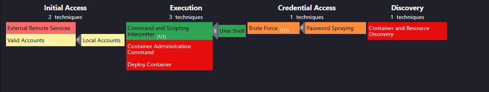
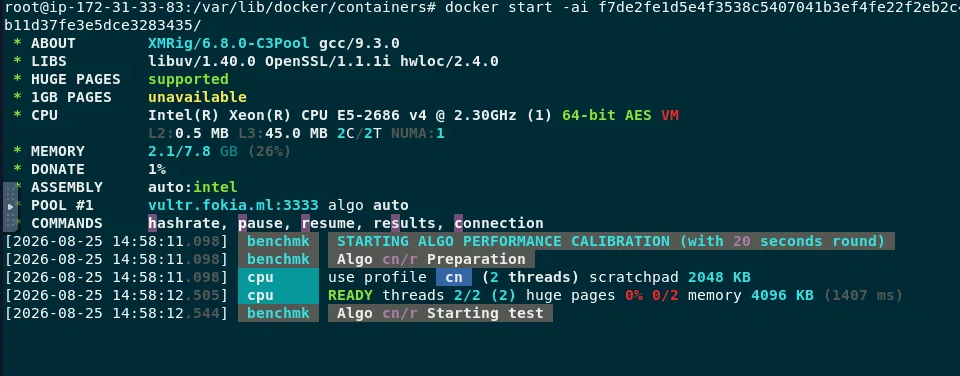

# Отчет об инциденте: SOC253 - A Malicious Docker Container Executed

Злоумышленник методом брутфорса (Password Spraying / Brute Force) подобрал учётные данные и получил доступ к валидной учётной записи пользователя. Через полученный доступ он выполнил команды в Unix Shell и развернул Docker-контейнер (Deploy Container). Анализ логов контейнера и его тестовый запуск показали, что внутри работает майнер криптовалюты Monero (XMR).

## Хронология / вектор атаки

| Этап (MITRE ATT&CK) | Техника | Действие |
|---|---|---|
| Credential Access | Brute Force / Password Spraying | Подбор учётных данных пользователя |
| Initial Access | Valid Accounts / External Remote Services | Вход под скомпрометированной учётной записью |
| Execution | Command and Scripting Interpreter (Unix Shell) | Выполнение команд на хосте |
| Execution | Container Administration Command / Deploy Container | Развёртывание вредоносного Docker-контейнера |
| Discovery | Container and Resource Discovery | Обнаружение ресурсов внутри контейнера/окружения |

## Cyber Kill Chain

**Reconnaissance:** Данных о разведке не зафиксировано, но, вероятно, атакующий заранее обнаружил открытый сервис/хост, доступный для подключения, и подобрал список учётных записей для перебора.

**Delivery:** Атакующий провёл перебор паролей (Password Spraying / Brute Force) против учётной записи пользователя, пытаясь подобрать валидные учётные данные.

**Exploitation:** Перебор оказался успешным - злоумышленник получил валидные учётные данные и вошёл в систему под легитимной учётной записью пользователя.

**Installation:** Получив доступ, атакующий выполнил команды через Unix Shell и развернул вредоносный Docker-контейнер (Deploy Container / Container Administration Command) - это и стало точкой закрепления полезной нагрузки в системе.

**Command & Control:** Контейнер после запуска установил соединение с майнинг-пулом Monero для получения заданий на вычисления и отправки результатов.

**Actions on Objectives:** Итоговая цель атакующего - незаконный майнинг криптовалюты Monero ($XMR) за счёт вычислительных ресурсов скомпрометированного хоста, что подтверждено анализом логов контейнера и его тестовым запуском.

## Рекомендации
- Используйте аутентификацию для защиты вашего API Docker.
- Добавьте сканирование образов в свой конвейер CI/CD для обнаружения уязвимостей или
вредоносных двоичных файлов.
- Используйте надежный базовый образ для своего приложения.
- Сервисы, активно используемые злоумышленниками, такие как RDP и SSH, не должны быть
открыты для удаленного доступа
