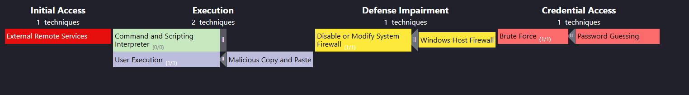

# Мини-отчёт об инциденте — SOC257

**Rule Name:** VPN Connection Detected from Unauthorized Country
**Тип инцидента:** Обход MFA, несанкционированный доступ через VPN, компрометация учётной записи

Алерт сработал на VPN-логин пользователя Julia с IP `212.8.243.136` (Нидерланды, страна вне разрешённого списка). Расследование показало, что атакующий заранее выполнил брутфорс учётной записи через OWA, прочитал письмо с OTP-кодом для MFA и с его помощью успешно вошёл в VPN. После этого атакующий по RDP подключился к рабочей станции Julia, отключил Defender/Firewall и загрузил файл, замаскированный под ransomware (GoldenEye), но не запустил его.

## Хронология / вектор атаки

| Этап (MITRE ATT&CK) | Техника | Действие |
|---|---|---|
| Credential Access | Brute Force (T1110) | Перебор пароля учётной записи Julia через OWA |
| Credential Access | Multi-Factor Authentication Interception (T1111 / T1556) | Чтение письма с OTP-кодом через скомпрометированный доступ к OWA |
| Initial Access | External Remote Services (T1133) | Успешный вход в VPN с использованием подобранного пароля и перехваченного OTP |
| Lateral Movement | Remote Services: RDP (T1021.001) | Подключение по RDP к рабочей станции пользователя Julia |
| Command and Control / Ingress Tool Transfer | Ingress Tool Transfer (T1105) | Загрузка архива Ransomware.GoldenEye.bin.zip на систему |
| Discovery | Account Discovery / System Owner Discovery (T1087 / T1033) | Выполнение `whoami`, `whoami /groups` |
| Discovery | Network Connectivity Discovery | Проверка доступа в интернет (`ping 8.8.8.8`) |
| Defense Evasion | Impair Defenses: Disable or Modify Tools (T1562.001) | Отключение Windows Defender и Firewall через PowerShell/netsh |

## Развитие атаки по модели Cyber Kill Chain

**Reconnaissance.** Атакующий определил внешний VPN-портал (`vpn-letsdefend.io`) и OWA-интерфейс как точки входа, пригодные для брутфорса.

**Delivery.** Через OWA был выполнен перебор пароля учётной записи `julia@letsdefend.io`.

**Exploitation.** Перебор оказался успешным — атакующий получил доступ к почтовому ящику Julia через OWA и смог прочитать письмо с одноразовым OTP-кодом, предназначенным для подтверждения MFA при входе в VPN.

**Installation.** Используя пароль и перехваченный OTP, атакующий успешно авторизовался в VPN, а затем закрепился в инфраструктуре через RDP-подключение к рабочей станции пользователя Julia.

**Command & Control.** С системы был выполнен ряд команд для разведки (`whoami`, `whoami /groups`, `ping 8.8.8.8`) и отключения средств защиты (Defender, Firewall) — подготовка системы к дальнейшим действиям.

**Actions on Objectives.** Атакующий загрузил на систему архив `Ransomware.GoldenEye.bin.zip`. Однако файл на диске оказался пустым, и признаков запуска ransomware в логах не обнаружено — предположительно, атакующему не хватило времени завершить атаку.

## Результат анализа
- IP атакующего (212.8.243.136) — хостинг-провайдер из Нидерландов; по VirusTotal чистая репутация, по AbuseIPDB ранее фигурировал в отчётах о Brute Force и Bad Web Bot.
- Подтверждено успешное чтение OTP-письма и обход MFA.
- Ransomware-файл на диске пустой, признаков исполнения не обнаружено.
- Hash файла: `1CDD1019D74197671019EA072E39BFC26F3B49491787D78B4786586370146C26`

## Скриншоты

## Рекомендации
- Внедрить защиту от брутфорса на OWA (recaptcha, lockout policy, rate limiting)
- Не доставлять OTP по email, если тот же email-аккаунт доступен через веб-интерфейс без доп. защиты — рассмотреть push/TOTP-приложения
- Настроить гео-ограничения доступа на Firewall/VPN
- Внедрить строгую парольную политику и запрет переиспользования паролей между сервисами
- Изолировать скомпрометированную систему от сети и провести полную проверку на предмет persistence
