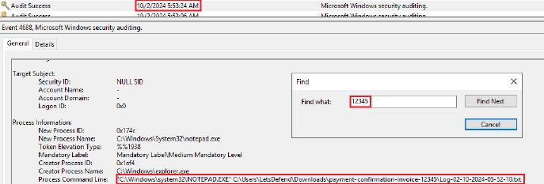
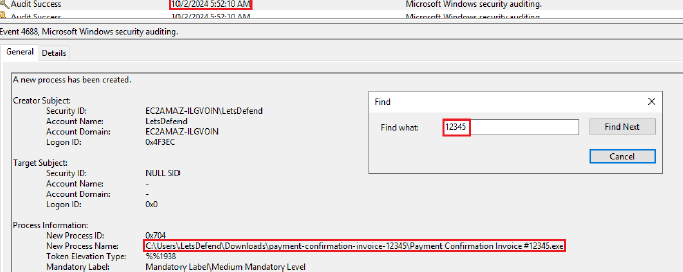
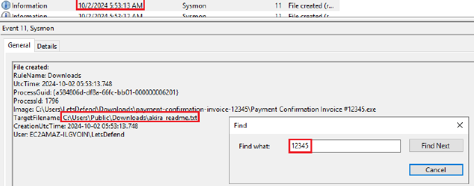
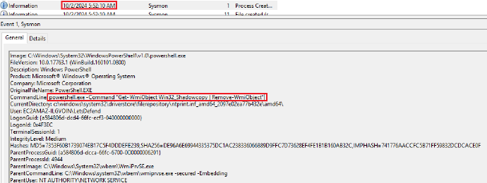
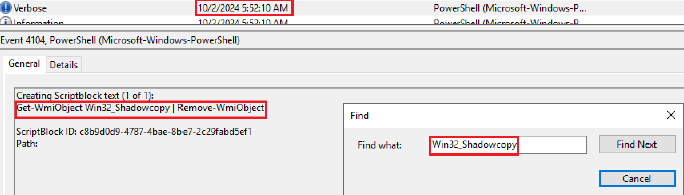
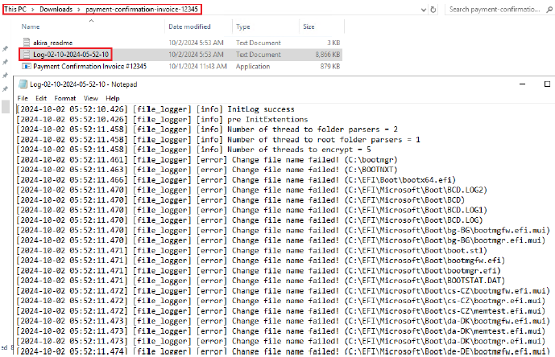
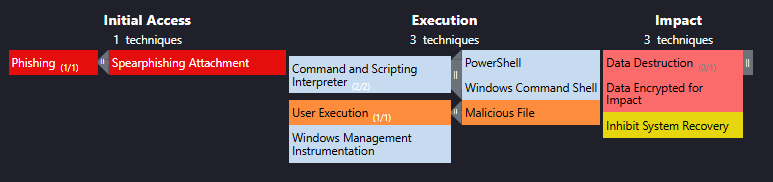

# Мини-отчёт об инциденте — SOC328

**Rule Name:** Akira Ransomware IOC's Detected
**Тип инцидента:** Фишинг, доставка и запуск ransomware, шифрование файлов

## Кратко
Алерт сработал на обнаружение IOC, принадлежащего Akira ransomware, на хосте Vergil (172.16.17.130). Расследование показало, что пользователь получил фишинговое письмо от `sale@thefasted.com` с вложением-архивом, замаскированным под подтверждение оплаты. После запуска извлечённого exe-файла на системе был отключён Windows Defender, удалены теневые копии (shadow copies), файлы зашифрованы с расширением `.akira`, а в системе оставлены записки с требованием выкупа (`akira_readme.txt`).

## Хронология / вектор атаки

| Этап (MITRE ATT&CK) | Техника | Действие |
|---|---|---|
| Initial Access | Phishing: Spearphishing Attachment (T1566.001) | Получено письмо от `sale@thefasted.com` с вложением `payment-confirmation-invoice-12345.zip` |
| Execution | User Execution (T1204.002) | Пользователь запустил `Payment Confirmation Invoice #12345.exe` из скачанного архива |
| Execution | Command and Scripting Interpreter: PowerShell / Windows Command Shell (T1059.001 / T1059.003) | Выполнение вредоносных команд, включая PowerShell |
| Execution | Windows Management Instrumentation (T1047) | Использование WMI для удаления теневых копий |
| Defense Evasion | Impair Defenses: Disable or Modify Tools (T1562.001) | Отключение Windows Defender (real-time protection выключен) |
| Impact | Inhibit System Recovery (T1490) | `Get-WmiObject Win32_Shadowcopy \| Remove-WmiObject` — удаление теневых копий |
| Impact | Data Encrypted for Impact (T1486) | Шифрование файлов на системе (расширение `.akira`) |
| Impact | Data Destruction (T1485) | Повреждение/удаление данных в рамках работы шифровальщика |

## Развитие атаки по модели Cyber Kill Chain

**Reconnaissance.** Данных о целенаправленной разведке не зафиксировано; атака имеет признаки массовой фишинговой кампании.

**Weaponization.** Злоумышленник подготовил фишинговое письмо с темой «Payment Confirmation» и вредоносным вложением `payment-confirmation-invoice-12345.zip`, содержащим exe-файл Akira ransomware.

**Delivery.** Письмо с вредоносным вложением доставлено на почту пользователя Vergil (`vergil@letsdefend.io`) с домена `thefasted.com`.

**Exploitation.** Пользователь открыл вложение и запустил `Payment Confirmation Invoice #12345.exe`, что привело к выполнению вредоносного кода на хосте.

**Installation.** В процессе выполнения вредонос отключил защиту Windows Defender (real-time protection), что позволило ему беспрепятственно продолжить работу на системе.

**Command & Control.** Явных признаков сетевого C2-взаимодействия в рамках расследования не выявлено; дальнейшие действия выполнялись локально через PowerShell/WMI.

**Actions on Objectives.** Ransomware удалило теневые копии для затруднения восстановления (`Remove-WmiObject`), зашифровало файлы на системе с расширением `.akira` и оставило записки с требованием выкупа (`akira_readme.txt`) в нескольких директориях, включая инструкции по связи через Tor.

## Результат анализа
- Хэш вредоносного exe `2C7AEAC07CE7F03B74952E0E243BD52F2BFA60FADC92DD71A6A1FEE2D14CDD77` подтверждён множественными источниками (VirusTotal, MalwareBazaar, ANY.RUN) как Akira ransomware.
- Домен отправителя `thefasted.com` помечен в VirusTotal как вредоносный/фишинговый.
- Вариант ransomware подтверждён через ID Ransomware (по `akira_readme.txt`) — Akira.
- Подтверждено расширение зашифрованных файлов `.akira`.
- Real-time protection Windows Defender была отключена на момент атаки — вероятная причина, по которой вредонос не был заблокирован.
- Атака ограничена одним хостом (Vergil), признаков распространения по сети не выявлено.
- Хост изолирован через Endpoint Security (Containment) для предотвращения дальнейшего распространения.
- Akira ransomware ассоциируется с группами GOLD SAHARA и PUNK SPIDER по данным MITRE.

## Скриншоты

## Рекомендации
- Усилить фильтрацию почты для блокировки/песочницы вложений типа .exe/.zip
- Провести обучение сотрудников по распознаванию фишинга
- Улучшить EDR-политики для детекта запуска вредоносных исполняемых файлов до их выполнения
- Мониторить и алертить на команды удаления теневых копий (`vssadmin delete shadows`, `Remove-WmiObject`, `bcdedit /set`, `cipher /w`)
- Проверить и протестировать план реагирования на ransomware-инциденты (изоляция, коммуникация, роли)
- Обеспечить наличие offline/облачных бэкапов, отключённых от основной сети
